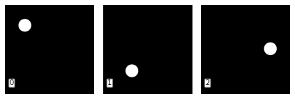

`multipagetiff` is a small python module that makes easy deaing with multipage tiff images stacks.
It implements depth color-coding by max-projection, like the Z-projection functions of ImageJ.


# `multipagetiff` example


```python
from multipagetiff import Stack, tools
import numpy as np
from matplotlib import pyplot as plt
```

## Open a multipage TIFF image


```python
st = Stack('Stack.tiff', dx=1, dz=1, units='mm')

print("the stack has {} pages".format(len(st))) # number of frames
```

    the stack has 3 pages


## plot a stack

Plot page by page. The Stack object behaves like a list, whose elements are the frames


```python
plt.subplot(1,3,1)
plt.imshow(st[0], cmap='gray')
plt.subplot(1,3,2)
plt.imshow(st[1], cmap='gray')
plt.subplot(1,3,3)
plt.imshow(st[2], cmap='gray')
plt.tight_layout()
```


Display the frame of the stack with the plot_frames function


```python
tools.plot_frames(st, cmap='gray')
```


## color code


```python
cc = tools.color_code(st)

plt.subplot(1,3,1)
plt.imshow(cc[0])
plt.subplot(1,3,2)
plt.imshow(cc[1])
plt.subplot(1,3,3)
plt.imshow(cc[2])
plt.tight_layout()
```


```python
tools.plot_frames(st, colorcoded=True)
```


## max projection

Create a color coded RGB image representing frame-depth. The image is the max projection of the color coded stack.


```python
mp = tools.flatten(st)
plt.imshow(mp)
```


    <matplotlib.image.AxesImage at 0x11aa9b208>


plot the max projection, together with its colorbar


```python
tools.plot_flatten(st)
```





## change colormap

Use a matplotlib preset colormap


```python
tools.set_cmap(plt.cm.cool)
tools.plot_flatten(st)
```


or define you own colormap


```python
from matplotlib.colors import LinearSegmentedColormap

my_colors = [(1,0,0),(0,1,0),(0.0,0.5,1)]
my_cmap = LinearSegmentedColormap.from_list("myCmap", my_colors, N=256)
tools.set_cmap(my_cmap)
tools.plot_flatten(st)
```


